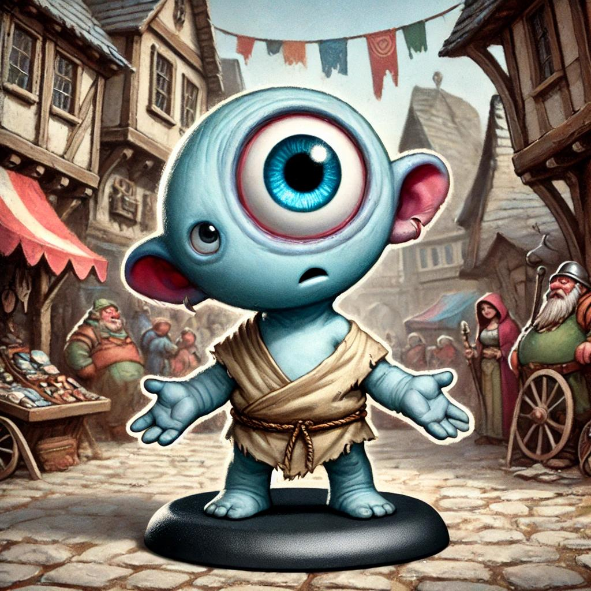

### Nachtmerries
Zowel Laevis als Tav worden op hetzelfde moment wakker van een nachtmerrie maar delen niet met de rest waar ze over gingen.

### Missie
De party krijgt hun eerste opdracht van Avaroth:
Ze moeten reclame maken voor het circus op het [Plein van de gouden handel](../Tar%20Neôl/Plein%20van%20de%20gouden%20handel.md). 
Ondertussen moeten ze zo veel mogelijk informatie vergaren over de lokale machten en wie er gebruik zou kunnen maken van de operationele actoren van het circus.

### Kwartiermeester
De party passeert bij de [Circus shop](Shops/Circus%20shop.md) van [Turdum Luidsnuit](NPCs/circus/Turdum%20Luidsnuit.md) en krijgen wat bevoorrading zoals Gildeschilden, wat potions, een scroll en een portie koekjes van Zossu.

Alsook krijgen ze flyers van het circus waar ze reclame mee kunnen maken.

### De poortwachters
De party wordt ondervraagd en verwelkomd door Hornfeld de Rhinokin poortwachter.

### Huidenwisselaarsgilde
Als Druïde dient Brior zich aan te melden aan de Huidenwisselaarsgilde. 
Na een saai interview waarin de verveelde kobolddame verifieert dat Brior zich niet kan voordoen als andere intelligente wezens, geeft ze hem een gildeschild.

# Het plein van de gouden handel
De party ontdekt het ronde plein met de handelscitadel, bank, tempel en handelsrechtbank.

Ze maken reclame en krijgen snel een publiek rond zich wanneer plots de Motley Marvels toekomen.

### [The Motley Marvels](../NPCs/The%20Motley%20Marvels.md)
Aeron herkent al snel zijn nemesis Corvin.

De party wint met vlag en wimpel de animation duel en krijgt duidelijk het publiek aan hun kant waarna de Marvels afdruipen naar een lokale taverne.

### Doggo
De party maakt kennis met een doggo die zich vlak voor het verlaten potion shop opstelt.

### Potion shop
De party ontdekt een verlaten potion shop waarvan de ramen en deuren zijn dichtgetimmerd.

### Bltng de Humonculus

De verloren gelopen Bltng vraagt Scoot voor de weg naar de Alchemiestraat.

### [Bonton Dabil](../NPCs/Bonton%20Dabil.md)
Brior maakt kennis met Bonton Dabil, de rijke handelaar met vele connecties. 

### Grondverzakking en spinnenaanval
Een onverwachte grondverzakking overvalt de party, waarna een groep spinnen en Chitinen hun aanvalt. 

De sessie eindigt bij het verslaan van deze geleedpotigen.