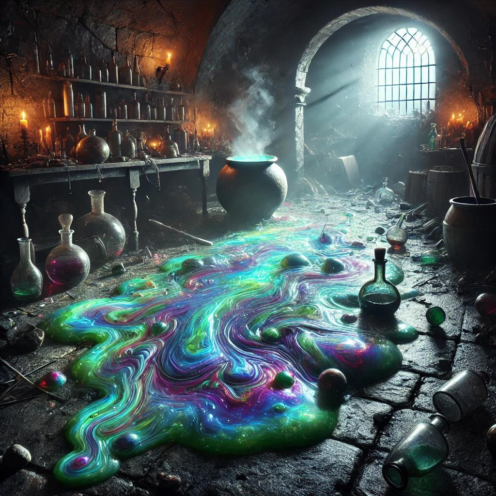
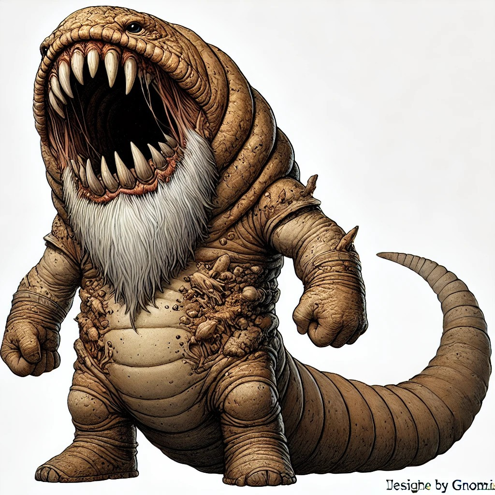

Laevis brengt de verwonde leeuw van Brior terug naar het Circus om verzorgd te worden.

De Party tapt van de Giant spiders 3 Potions of Giant Spider poisen af. 

Aeron maakt kennis met Armmund Krimkrul, de Dwerg bankier met donkerrode haren.
Armmund vertelt over verschillende andere zinkgaten die ontstaan zijn in de stad maar snel zijn opgevuld door de Bouwgilde.

De Party daalt af in de tunnel, waar ze steenachtige drollen vinden, in sommige vinden ze middenin edelstenen. Brior de Giant Badger probeer Aeron te foppen door extra drollen achter te laten. Aeron tracht de Giant Badger met zijn snuit in zijn verse drol te duwen.

# Potion shop
De tunnel komt langs de zijkant uit op de kelder van de potion shop.

In de kelder wordt er gevochten met een Alchemical Ooze die de party aan verschillende random potion effecten blootstelt en magische aanvallen terugkaatst.

In de kelder ligt een schrift, waar een eigenaardige koper in vermeld staat die zijn potion wilt laten leveren bij een oude ruïne. 

Een logboek in de winkel duidt op een grote verkoop van potions die van gedaante laten verwisselen. Een van de kopers is de Druwedren.

Brior vindt genoeg gerief voor een herbalism kit.

In het labo van de potion shop wordt een grote opstelling gevonden om potions te creëren.

Verschillende potions worden gevonden.

### De onderstad
In de kelder breekt Scoot de deur open naar [de onderstad](Main/Tar%20Neôl.md ), waar Brior hem de schrik op het lijf jaagt.

Achter de deur bevindt zich een uithoek van de onderstad. Dit deel is duidelijk heel nieuw.

# The Terragnaws
De party onderzoekt de tunnel aan de grondverzakking verder na een welverdiende short rest.

Na enkele honderden meters worden ze overvallen door twee Terragnaws die hun sandwichen. Na een hevige strijd met meerdere downed partymembers weten de avonturiers deze wilde tunnelmonsters te verslagen.

### Terugkeer
De party keert terug naar het circus, waar ze verslag uitbrengen en een [contract](../img/Contract.pdf) aangeboden krijgen.
