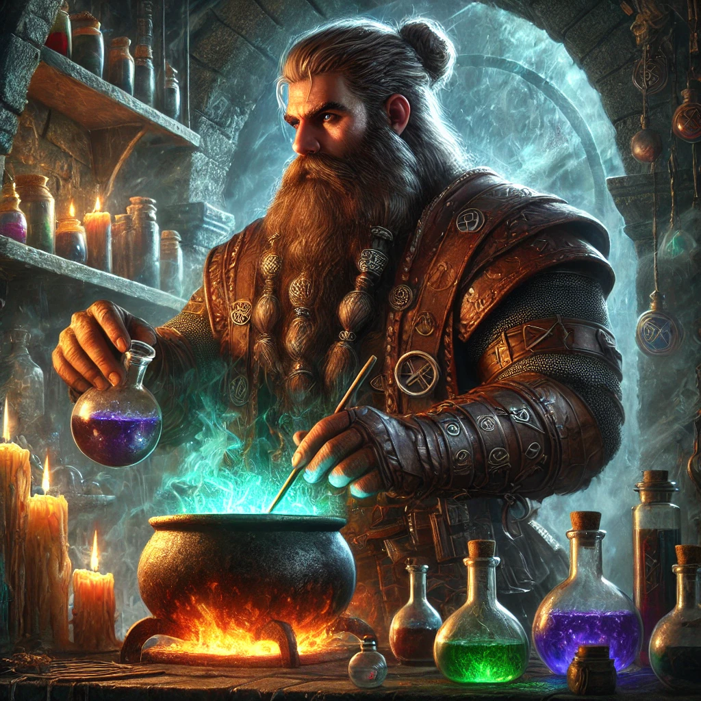
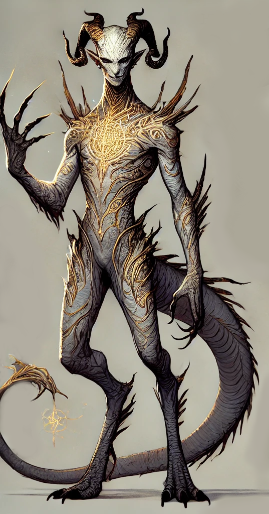

## The Disposal Chamber

#### **Description**

Jullie dalen af in een **zwak verlichte kamer**, diep verborgen onder de stad. De lucht wordt zwaar van de **stank van verrotting**, vermengd met een wrange geur van **alchemisch residu**. Elke ademhaling voelt verkeerd. De stenen muren druipen van het condens, en de vloer voelt zompig onder jullie voeten.

In het midden van de ruimte ligt een **torenhoge stapel mismaakte lijken**—gemuteerde lichamen, misvormd en afgedankt. Ledematen groeien in verkeerde richtingen, ogen zijn dichtgesmolten, monden bevroren in een eeuwige schreeuw. Dit zijn geen slachtoffers van een gevecht, maar **mislukkingen**—**achtergelaten experimenten** van de sekte, weggegooid als bedorven ingrediënten.

Toch blijven de lichamen stil. Geen beweging. Geen gekreun. Geen teken van ondood.

Maar er klopt iets niet.

Een **dunne, iriserende nevel** zweeft loom boven de lijken, krult en glijdt als rook over water. Ze glinstert in misselijkmakende kleuren en beweegt met een soort bewustzijn dat je koude rillingen bezorgt.

Het zijn niet de doden die je hier moet vrezen.

Het is de **mist**.

Twee gangen leiden verder, het Collectief kiest voor de linkse.

## The secret alchemical chamber
[Daryll Stonebrew](Hidden/NPC's/Daryll%20Stonebrew.md) Is vastgeketend en aan het werken aan Drbn, een van Zhiran's assistenten.

Drbn is gemuteerd en lijkt nu op een Blinkmaw.

## The Mural Chamber
#### Murals
Drakong (lizard-gorilla), Centaur, Leonin, Velhorn (bull-deer), basilignar (basilisk boar), mammuphant, golgrotter (gargoyle-chtulu), satyr, kenku, ent like creature

### Plafond
Aan het plafond hangen 16 pods, 5 waarvan geopend zijn.

### Deur
Grote stenen deur met stervormige knop, omringd door 4 cirkels

1 speed: leonin, panther, hawk, velociraptor.
2 strength: rhinokin, troll, gorilla, giant.
3 adaptability: blinkstalker, chameleon, changeling, werewolf.
4 resilience: giant tortoise, duergar, boar, Minotaur.

Brior opent enkele van de Pods, waar Blinkmaw's uitkomen, beholderkin met camouflage- en teleportationkrachten.

Tav vindt het antwoord op de puzzel, de creaties van [Thryssaeon](../Pantheon/Thryssaeon.md): De Leonin, De Rhinokin, de Blinkstalker en de Minotaur.

## The Ritual of Ascension
De Augmentor staat met zijn rug naar de party en bekijkt 7 cultists, waaronder een cultist captain, die aan het chanten zijn voor de ritual of ascension van een 8ste cultist.

De **achtste cultist** zweeft in een **donkere, pulserende bol**. Zijn lichaam draait langzaam rond, alsof het losstaat van zwaartekracht of logica. Terwijl hij roteert, **verandert zijn vorm voortdurend**—**willekeurige ledematen, klauwen, tentakels en staarten** verschijnen en verdwijnen over zijn lijf in een onheilspellend ritme.

Zijn vlees gehoorzaamt geen natuurwetten meer. Wat ooit een mens was, wordt nu een **levende manifestatie van mutatie**.

4 metalen vuurschalen met voidglass vuur staan rond de ascension, de paarse rook trekt in de bol.

## De augmentor

De Augmentor verwelkomt het collectief en nodigt hen uit om deel te worden van de volgelingen van Thryssaeon, immers zijn er onder hun kinderen van Thryssaeon aanwezig.
De kracht van evolutie moet steeds gevoed worden met mutaties en vooruitgang en zo kunnen ook de actoren sterker worden.

Laevis adt 1 portie essence of duskbloom en krijgt complimenten van de Augmentor, ze streeft duidelijk macht na en is niet schuw om daar offers voor te brengen.
Laevis ziet dit niet als compliment en valt de Augmentor aan. 

De Augmentor houdt zich initieel afzijdig in het gevecht, maar wanneer zijn volgelingen te snel het onderspit delven, neemt ook hij deel aan de strijd. Verschillende hold persons, gemiste aanvallen en willekeurige mutaties van Laevis (Ze wordt blauw en groeit een baard van veren) later weten de actoren de krachtmeting te winnen.
Het lijf van de Augmentor lost op nog voor het de grond raakt.
Het ritueel valt uit elkaar zodra de brandende voidglass geblust is, een massa vlees, organen en ledematen blijft over.

### Loot
Het Collectief vindt:
20k GP aan Voidglass, welke ze terugbrengen naar Zhiran Vaen.
100 GP aan Holy Symbols.
1 set [Bracers of the Orc](../PC's%20en%20homebrew/Items/Bracers%20of%20the%20Orc.md)
300GP aan Blinkstalker kaakbeenderen
de overige 500GP aan koopkrediet bij ../[Het Ecliptisch Emporium](Shops/Het%20Ecliptisch%20Emporium.md), samen met nog 125GP van vorige sessie. kan ook ingeruild worden voor 416GP.

