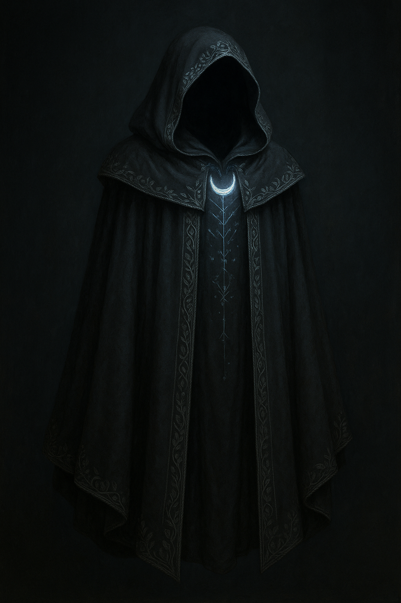

_Hand-woven by Tilda Threadbone for Father Elephas._

## ⭐ Overview

**Rarity:** Rare (requires attunement)  
**Creator:** Tilda Threadbone — master seamstress of Silvermourn.  
**Purpose:** A cloak designed specifically to allow Father Elephas to function near the Moonstone Crystal’s magic-suppressing field.

# 🌙 Core Feature

## **Moonstone Defiance**

The wearer is completely unaffected by magical suppression from the Moonstone Crystal or similar suppression fields.

Tilda crafted this so that **Father Elephas** in Silvermourn could still cast protective magic.

---

# ✨ Additional Features

## **Resonance Veil** _(Reaction)_
(once per day)
When the wearer is targeted by a spell or magical effect:
- As a reaction, they gain **resistance** to that spell’s damage until the start of their next turn.
The cloak bends hostile magic around the wearer.

---

