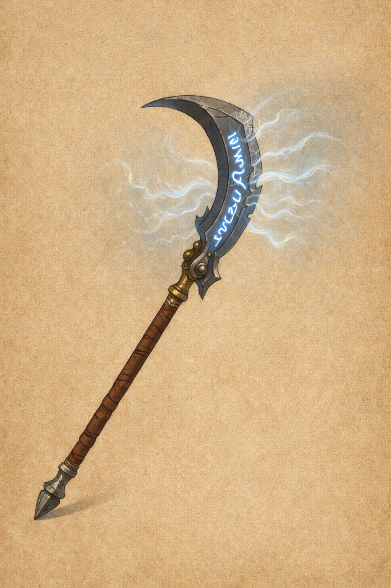

### **Screeching Glaive**

_Weapon (glaive), rare (requires attunement)_

This polearm hums with latent energy. Serrated and curved like the talon of some monstrous bird, its **blade is etched with runes that glow faintly when drawn**, and emit a high-pitched keening wail when swung in combat. The sound builds in intensity with each strike, until it bursts forth in a thunderous scream of force.

---

**You gain a +1 bonus to attack and damage rolls made with this magic weapon.**

---

**Thunderwave Slash (1/long rest):**  
When you make a melee attack with the Screeching Glaive, you can choose to unleash a wave of sonic force in a **15-foot cone** (instead of a cube), originating from you and **in the direction of your swing**.

- Each creature in the cone must make a **DC 13 Constitution saving throw**.
    - On a failed save, a creature takes **3d8 thunder damage** and is **pushed 10 feet away** from you.
    - On a successful save, the creature takes half as much damage and isn't pushed.
- **Objects that aren't being worn or carried** are also pushed if they're in the cone.
- This feature **recharges on a long rest**.

---

**Notes:**
- The cone is directional (like a dragon’s breath weapon), allowing for strategic use in crowded melee.
- This is a **modified version of the _Thunderwave_ spell**, more appropriate for a sweeping glaive strike.
- A Raging barbarian can use the Thunderwave Slash, as it is not casting a spell but as unleashing the magic in the glaive. 

 
