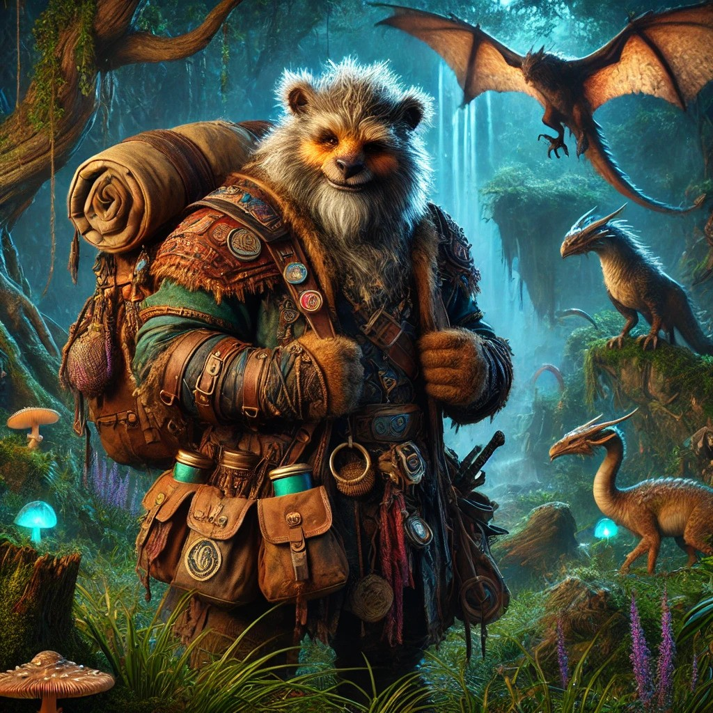

Durdur is een bugbear en voorziet de show van verschillende exotische dieren. 
Het verzorgen van de dieren gebeurt door drie gnomenmeisjes, [[NPC/Lanja, Lavna en Lagna]], die hij gered heeft van verdrinkingsdood bij het zinken van een schip op de Yzerzee.

Durdur is voorzien van een grote jutte zak die leidt tot een minidimensie waar zijn exotische dieren de ruimte hebben om te leven en verzorgt te worden. 

