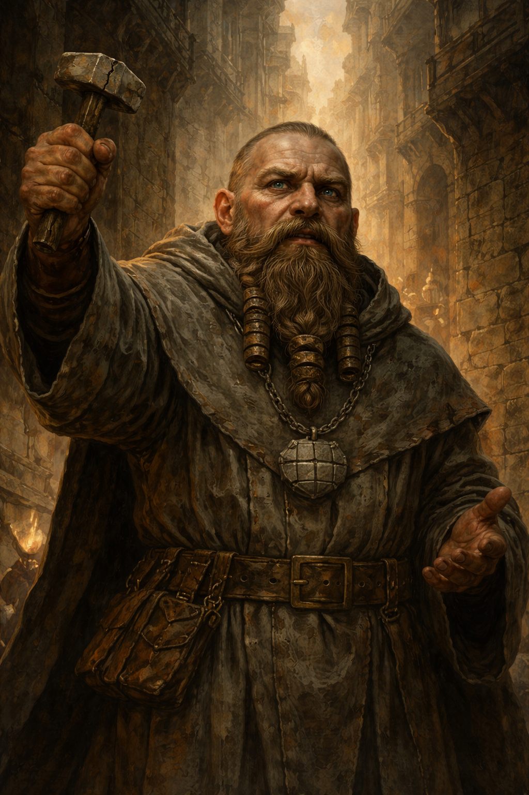

# 🧱 Tolrik Ashlar

**Race**: Dwarf
**Faith**: Caelreth — god of walls, borders, thresholds
**Role**: Street preacher / minor temple speaker
**Disposition**: Earnest, strained, deeply unsettled

Appearance & Presence

Broad-shouldered, compact even by dwarven standards

Stone-grey robes reinforced with visible seams and patches

Beard braided short and tight, bound with iron rings shaped like bricks

Carries a small mason’s hammer with a hairline crack in the head

Speaks with a trained, resonant voice meant to carry across stone streets

He looks like someone who has spent a lifetime repairing walls.

What Makes Tolrik Different

Tolrik is not shouting doom.

He is trying to warn without causing panic, and that restraint makes him more frightening.

He believes:

Borders are maintained, not guaranteed

Faith is upkeep, not certainty

Neglect, not attack, is what destroys civilizations

And now… upkeep no longer works.