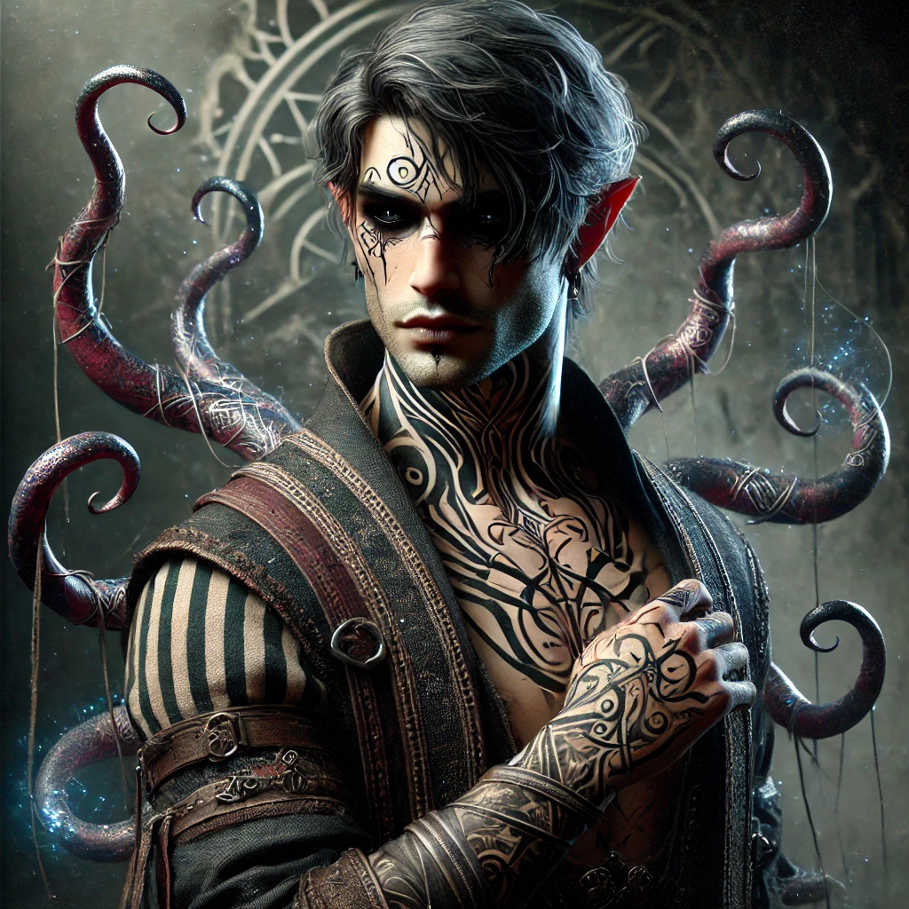

Azter Ib Azzas is werd als kind door [[Naqaab|Naqabi]] slavenhandelaars aan een [[Qhass|Qassqaïï]] atramentomagiër (tattoeagebezweerder). 
De kleine Azter werd maanden lang voor pijnlijke en duistere experimenten gebruikt tot de atramentomagiër het resultaat op zichzelf uittestte en het leven er bij liet.

Zijn tatoeages leiden een eigen leven, maar als hij zich sterk concentreert kan Azter de tatoeages controleren en los laten komen van zijn lichaam. 
Met deze inktachtige, schaduwkleurige appendices kan hij zichzelf bevrijden uit elke handboei, slot, ketting of kooi.
