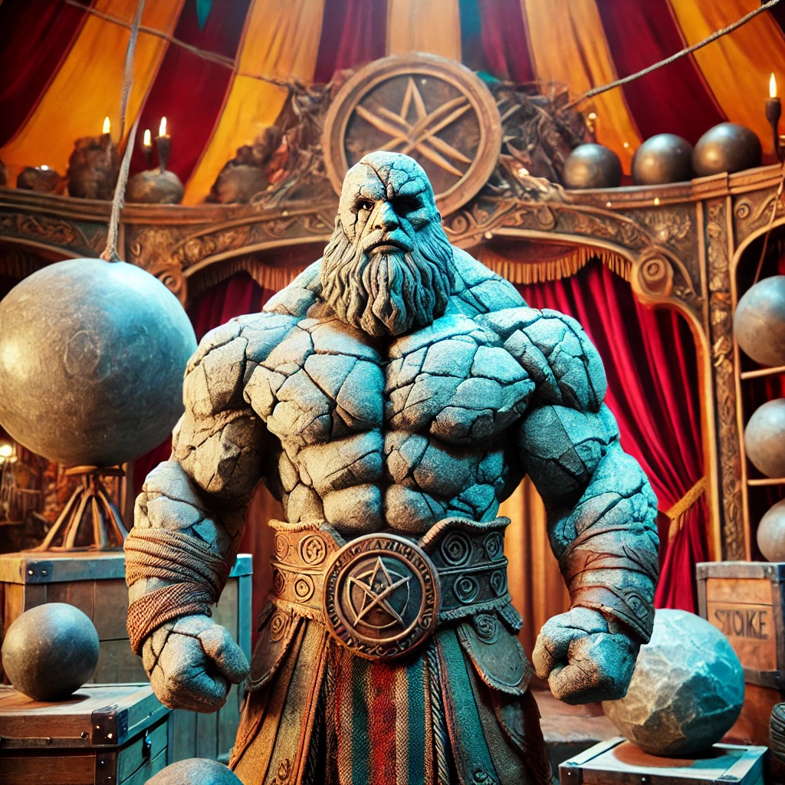

Duaines moeder, Johanna, werd vlak voor zijn geboorte vervloekt met een lithomantische bezwering die haar over tijd in steen zou veranderen.

Hoewel Johanna de vloek niet overleefde, kon Duaine gezond opgroeien bij zijn vader op één detail na: Duaine is volledig van levend steen gemaakt, wat handig is in een messengevecht maar zwemmen een pak moeilijker maakt. 

Duaine is de sterke hand in het circus en krijgt steeds de fysiek zware taken op zich, waar hij graag over zaagt maar eigenlijk van geniet. 
In zijn strongmanshow is hij enkel nog maar door een halfreus en een goliath, die beide toch onder de indruk waren van deze versteende mens.

Duaine verzamelt ook stenen. 