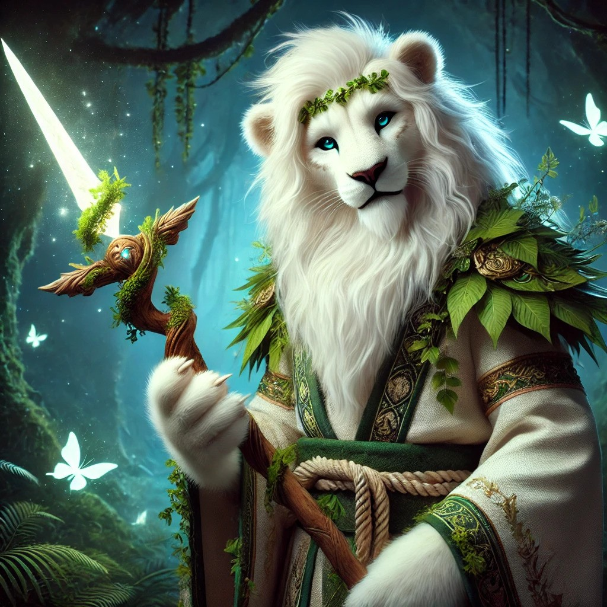

# Brior Lunarmane

Leonin circle of the shepherd druid

My parents died at a young age. An elder in my village took me in and took care of me as if I was his own child. He did not have much, but did what he could to raise me healthy. When I was 12, he fell ill. I had to steal food and supplies in order to survive. Unfortunately, my caregiver did not survive his illness. From what I stole and gathered, I managed to pay sufficient tuition for an Art/Performances school.

I have a sworn nemesis, this is Corvin Wildfire. He grew up in the same town as I did, went to the same school. He always was a first class ass-kisser who got everything he wanted because he had rich and powerful parents. I had to fight long and hard in order to be the performer I am today. I resent him for being a talentless, good-for-nothing performer. Whenever he is performing nearby, I hide in the audience and use my sorcery to mess up his shows.

I have a longing to know what my life would have been with my parents and not a single night goes by without me dreaming about them. The difficult childhood turned me into a rather cynical and sarcastic person, but bringing laughter and awe in the audience with my performances lifts my spirits.
