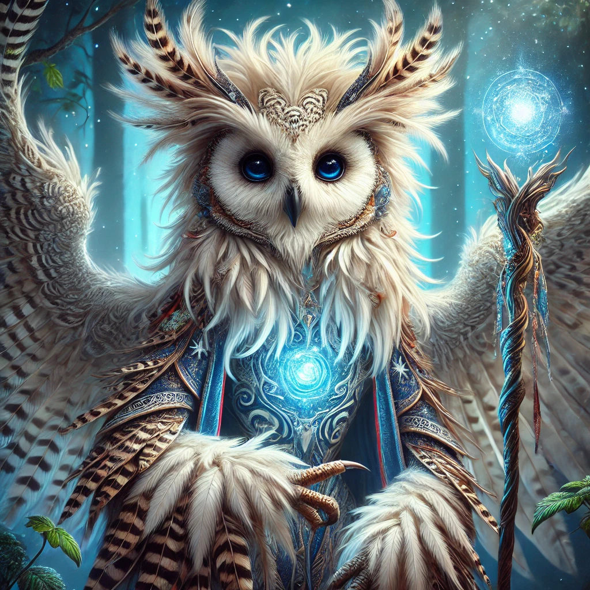

De party bestaat uit

## Aeron Nightbreeze

Owlin sorcerer

## Brior Lunarmane

Leonin druid

## Scoot McToot

Tortle barbarian
[] (../PC's%20en%20homebrew/Scoot%20McToot.md)

## Tav Marvelous

Human sorcerer

## Laevis Hollowtail

Harengon paladin

## Breala Gleambow

Lizard-folk cleric

## Mark Van Zee

Triton warlock

