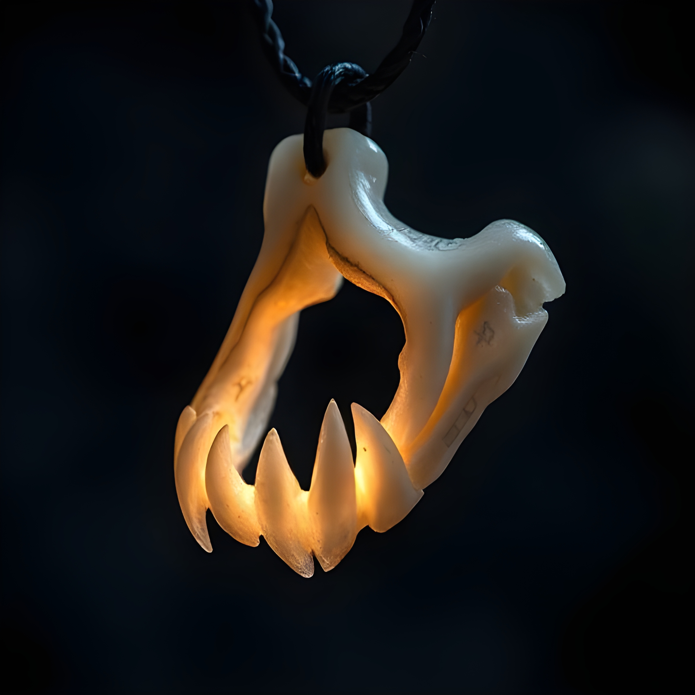

### **Blinkstalker’s Maw** _(Wondrous Item, Uncommon 200 GP)_
A preserved jawbone from a **Blinkstalker**, a rare predator from the deep dark with both camouflage and short-range teleportation abilities. The jawbone hums faintly with latent magic.

**Properties:**
- When worn as a pendant, the bearer can **shift their colors** to blend with their surroundings, gaining **advantage on Stealth checks** for up to **1 minute, three times per day**.
- Once per day, the wearer can use the jawbone’s magic to **misty step (30 ft.)** as a bonus action.