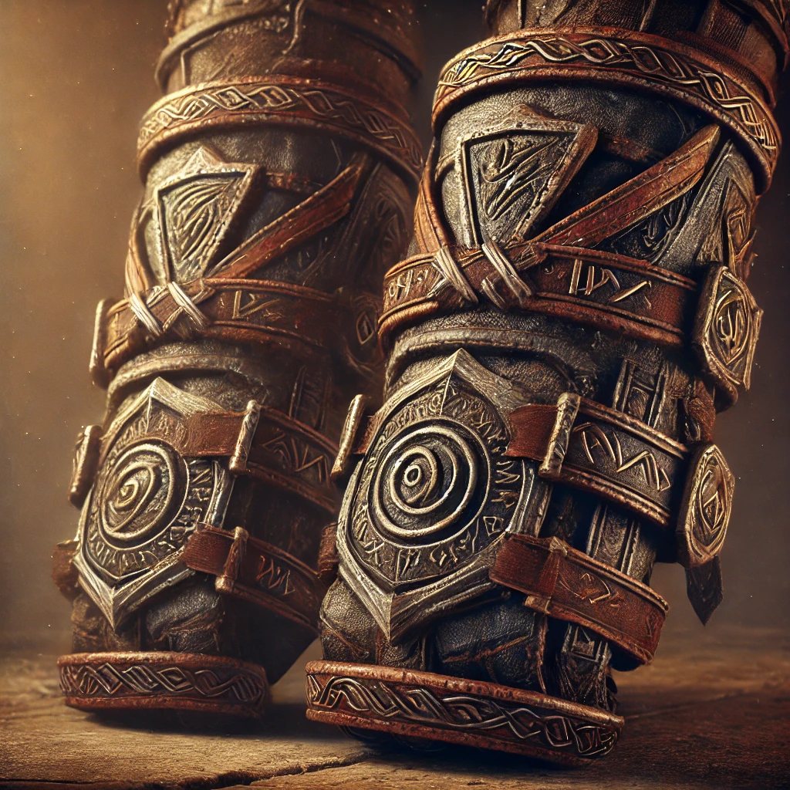

### **Bracers of the Orc**

_Wondrous Item, Rare (Requires Attunement)_

Forged in the fires of countless battles, these bracers are said to carry the unyielding will of the orcish warlords. Made of hardened leather reinforced with rune-etched metal bands, they pulse with primal energy, granting the wearer a measure of the orc’s relentless endurance.

#### **Effects:**

- While wearing these bracers, you gain a **+1 bonus** to either **Strength** or **Constitution** (your choice upon attunement).
- **Relentless Endurance:** When you are reduced to **0 hit points** but not killed outright, you can **drop to 1 hit point instead**. You can’t use this feature again until you **finish a long rest**.

Legends speak of orcish champions who refused to fall in battle, driven by sheer willpower alone. These bracers echo their undying resolve, ensuring that even in the face of death, you will stand once more.

