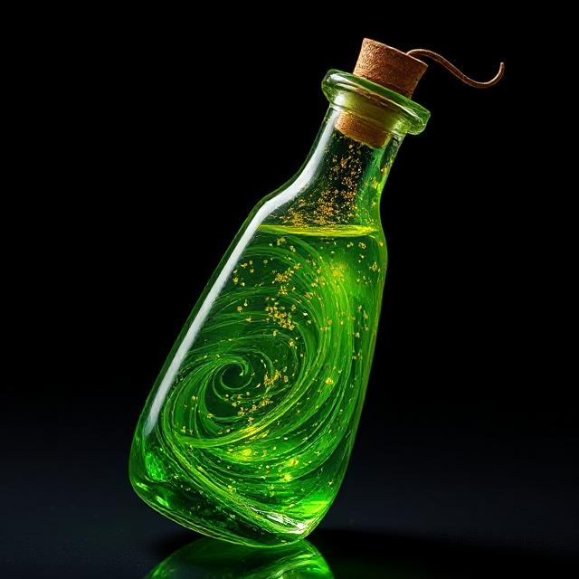

# Potions of Serpent's Reflex

When you drink this potion, you gain the effect of the haste spell for 1D8 + 1 rounds (no concentration required). 

Until the effect ends, your speed is doubled, you gain a +2 bonus to AC, you have advantage on Dexterity saving throws, and you gain an additional action on each of your turns. That action can be used only to take the Attack (one weapon attack only), Dash, Disengage, Hide, or Use an Object action.

When the spell ends, you can’t move or take actions until after its next turn, as a wave of lethargy sweeps over you.

125GP

