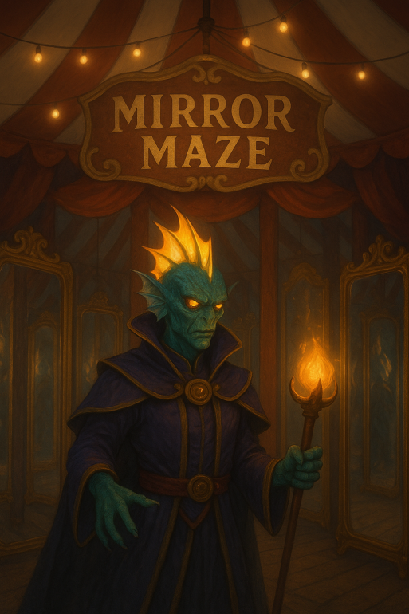

# Mark Van Zee

_Race:_ Triton  
_Class:_ Warlock (The Great Old One)  
_Alignment:_ Chaotic Good  
_Affiliation:_ Circus van Avaroth  
_Patron:_ De gedaante achter de spiegel

### Vroege Leven

Mark Van Zee groeide op in een rustig tritondorp diep onder de oceaan. Hij werkte er als weerman, een gerespecteerde functie in de gemeenschap. Want zelfs onder water kent men het weer: stromingen, temperatuurverschillen en getijden. Mark was een man van orde en regelmaat, gedreven door de wens om de wereld te begrijpen via patronen en voorspellingen.

Maar die orde zou op een dag verbrijzeld worden.

### De Spiegel

Tijdens een meting in een gebied met sterke stroming vond Mark een vreemd voorwerp tussen het aangespoelde wrakhout: een spiegel. Het glanzende oppervlak weigerde het omringende water te weerspiegelen. Uit nieuwsgierigheid keek hij erin, en zag iets wat niet van deze wereld was.

Voor een fractie van een seconde ving hij een glimp van de wereld achter de spiegel: een plek van chaotische schoonheid, waarin vormen vloeiden, gedachten tastbaar leken, en logica ophield te bestaan. Vanaf dat moment werd Mark’s fascinatie met de natuurlijke orde vervangen door een obsessie met de spiegelwereld.

Langzaam begon zijn lichaam te veranderen. Zijn hoofdvin straalde zacht licht uit, als een lichtgevende hanenkam, een zichtbaar teken van de vreemde energie die door hem stroomde.

### Verbanning

Zijn transformatie wekte angst in zijn dorp. De mensen die hij kende keerden zich van hem af; zijn huis werd bedolven onder zand, als symbool van zijn uitsluiting. In hun ogen was hij een paria, een dienaar van iets onbegrijpelijks.

Verjaagd uit de diepte trok Mark naar de oppervlakte. Het leven daar was hard. Honger, kou en een wereld zonder water maakten elke dag tot een strijd.

### Het Circus van Avaroth

Uiteindelijk vond Mark zijn toevlucht bij het **Circus Avaroth**, een rondreizende troep van zonderlingen, illusies en wonderen. Hij bood zijn diensten aan als uitbater van het Spiegelpaleis, een attractie waarin bezoekers een glimp krijgen van wat lijkt op de spiegelwereld — al is het voor hen slechts een imitatie.

In ruil krijgt hij voedsel, onderdak en tijd om zijn onderzoek voort te zetten. Toch blijft hij op de achtergrond; sociaal contact interesseert hem minder dan de mysteries die door glas fluisteren. De wereld op het land stoort hem, en specifiek de hemel met haar grenzeloze leegte, hij voelt zich veiliger binnen, tussen muren en spiegels.

### Persoonlijkheid

Mark Van Zee is geobsedeerd, maar niet verdorven. Zijn pact met de entiteit achter de spiegel heeft zijn begrip vergroot, maar zijn geweten behouden. Hij blijft handelen uit overtuiging van goedheid, al kiest hij vaak onconventionele of chaotische wegen om die te bereiken.

