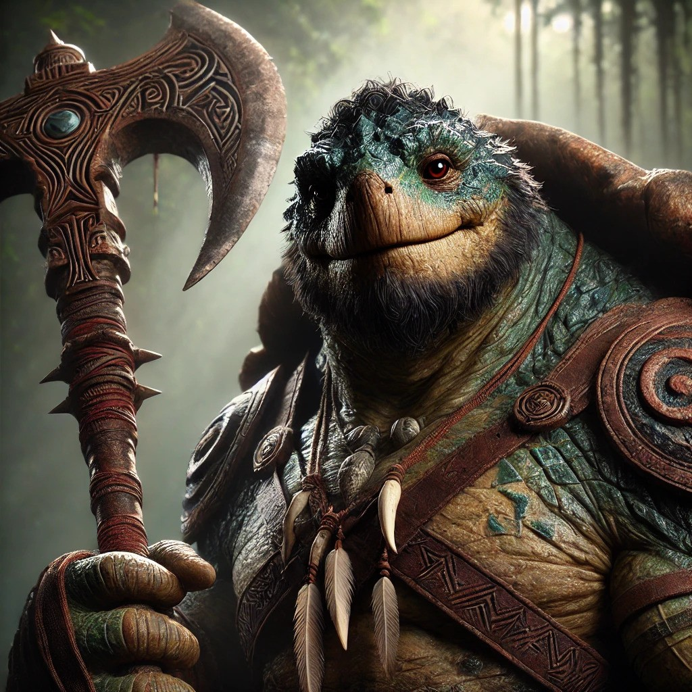

>[!column|flex 2]
>> [!infobox]
>> # `=this.file.name`
>> 
>> ###### Stats
>>  |
>> ---|---|
>> **Level** |`=this.level` |
>>  **Speed** |`=this.Speed` |
>> **Proficiency** | +`=this.Prof` |
>> **Initiative** | +`=(this.DEX - 10)/2` |
>> **AC** | `=this.AC`
>> **HP** | `=this.HP - this.DmgTkn + this.TempHP` |
>> **Hit Dice** | `=this.Level + this.HitDice`  |
>> **Passive Perception** |
>>  
>> ###### Bio
>>   |
>> ---|---|
>> **Race** | `=this.race` |
>> **Sex** | `=this.gender` |
>> **Age** | `=this.age` |
>> **Sexuality** | `=this.sexuality` |
>> **Alignment** | `=this.alignment` |
>> ###### Info
>>   |
>> ---|---|
>> **Class(s)** | `=this.Class` |
>> **Sub-Class(s)** | `=this.Subclass`
>> **Group(s)** | `=this.AssociatedGroup` |
>> **Religion(s)** | `=this.AssociatedReligion` |
>> **Current Location** | `=this.Location` |
>>  ### Currency
| Copper         | Silver         | Gold         | Platinum         |
| -------------- | -------------- | ------------ | ---------------- |
| `=this.Copper` | `=this.Silver` | `=this.Gold` | `=this.Platinum` |
>
>> [!infobox] Death Saves
>> ### Death Saves
| Success | <input type="checkbox" unchecked>  | <input type="checkbox" unchecked> | <input type="checkbox" unchecked> | 
| ------- | --- | --------------------------------- | --------------------------------- |
>>
| Fails | <input type="checkbox" unchecked>  | <input type="checkbox" unchecked> | <input type="checkbox" unchecked> | 
| ----- | --- | --------------------------------- | --------------------------------- |
>>
>> ### Skills
| Skill | Score       | Mod                     | Prof                              | ST                                  |
| ----- | ----------- | ----------------------- | --------------------------------- | ----------------------------------- |
| **STR**   | `=this.STR` | +`=(this.STR - 10)/2`   | <input type="checkbox" checked> | +`=(this.STR - 10)/2 + this.prof`               |
| **DEX**   | `=this.DEX`  | +`=(this.DEX - 10)/2`   | <input type="checkbox" unchecked> | +`=(this.DEX - 10)/2`               |
| **CON**   | `=this.CONST` | +`=(this.CONST - 10)/2` | <input type="checkbox" checked>   | +`=((this.CONST - 10)/2) + this.prof` |
| **INT**   | `=this.INT`          | +`=(this.INT - 10)/2`   | <input type="checkbox" unchecked>   | +`=((this.INT - 10)/2)`   |
| **WIS**   | `=this.WIS`          | +`=(this.WIS - 10)/2`   | <input type="checkbox" unchecked> | +`=(this.WIS - 10)/2`               |
| **CHA**   | `=this.CHA`          | +`=(this.CHA - 11)/2`   | <input type="checkbox" unchecked> | +`=(this.CHA - 11)/2`               |
>> ### Skill Checks
| Ability               |                                   | Mod |
| --------------------- | --------------------------------- | --- |
| Acrobatics (DEX)      | <input type="checkbox" unchecked> | +`=(this.DEX - 10)/2`   |
| Animal Handling (WIS) | <input type="checkbox" unchecked> | +`=(this.WIS - 10)/2`  |
| Arcana (INT)          | <input type="checkbox" unchecked> | +`=((this.INT - 10)/2)`  |
| Athletics (STR)       | <input type="checkbox" checked> | +`=((this.STR - 10)/2 + this.prof)`   |
| Deception (CHA)       | <input type="checkbox" unchecked> | +`=(this.CHA - 11)/2`  |
| History (INT)         | <input type="checkbox" unchecked> | +`=(this.INT - 10)/2`  |
| Insight (WIS)         | <input type="checkbox" unchecked>   | +`=((this.WIS - 10)/2)`  |
| Intimidation (CHA)    | <input type="checkbox" checked> | +`=(this.CHA - 11)/2`  |
| Investigation (INT)   | <input type="checkbox" unchecked>   | +`=((this.INT - 10)/2)`  |
| Medicine (WIS)        | <input type="checkbox" unchecked> | +`=(this.WIS - 10)/2`  |
| Nature (INT)          | <input type="checkbox" unchecked> | +`=(this.INT - 10)/2`  |
| Perception (WIS)      | <input type="checkbox" checked>   | +`=((this.WIS - 10)/2) + this.prof`  |
| Performance (CHA)     | <input type="checkbox" unchecked> | +`=(this.CHA - 11)/2`  |
| Persuasion (CHA)      | <input type="checkbox" unchecked> | +`=(this.CHA - 11)/2`  |
| Religion (INT)        | <input type="checkbox" unchecked> | +`=(this.INT - 10)/2`  |
| Sleight of Hand (DEX) | <input type="checkbox" unchecked> | +`=(this.DEX - 10)/2`   |
| Stealth (DEX)         | <input type="checkbox" checked> | +`=(this.DEX - 10)/2 + this.prof`   |
| Survival (WIS)        | <input type="checkbox" checked> | +`=(this.WIS - 10)/2 + this.prof`  |

