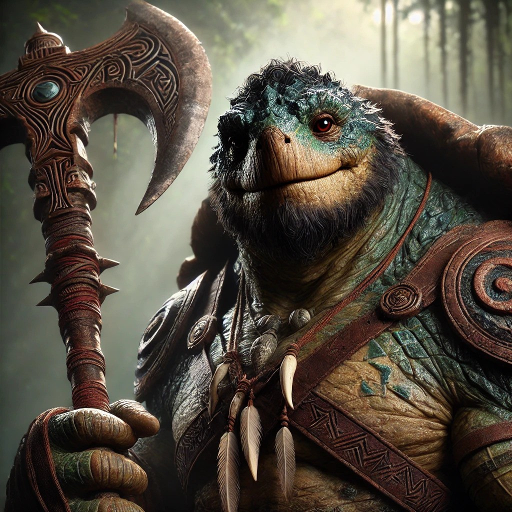

# Scoot McToot 
Scoot McToot is een Tortle ancestral guardian barbarian

Ik ben Scoot McToot, de schildpad die wel eens boos durft te worden en in het bos leeft. Ik woonde daar op m'n eigen, en dat was wel prima. 
Enkel met de scouting gilde had ik redelijk wat contact. Ik hielp hen met de weg door het bos te vinden, leren sporen zoeken, survival skills aanleren etc. Daar heb ik wel een goede reputatie. 
Ik heb ook een verschrikkelijke angst van spinnen, ik zie die echt niet graag. Er miste wel iets, ik had meer nood aan contact met de bewoonde wereld en iedereen die daar woont. Toen er dus een rondtrekkend circus langskwam, besloot ik om me bij hen aan te sluiten. Dus nu ben ik de assistent van Duaine de Steenling, en dat is wel leuk, vooral omdat ik ook graag stenen verzamel. Voor het grote publiek optreden kan ik niet, ik heb namelijk anger management issues.
